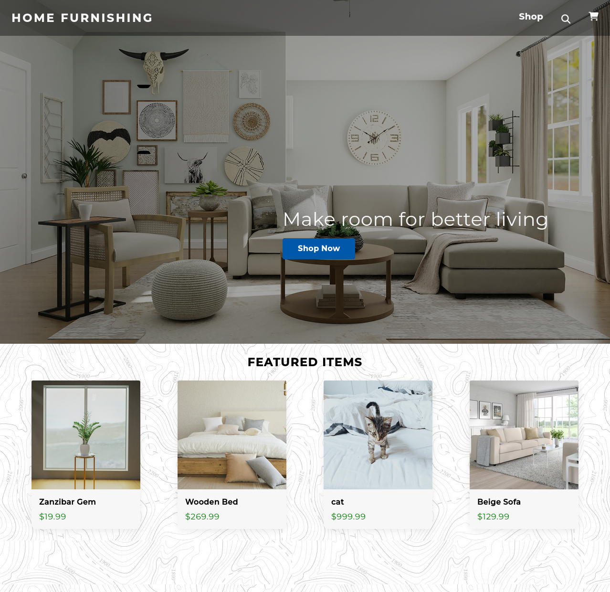
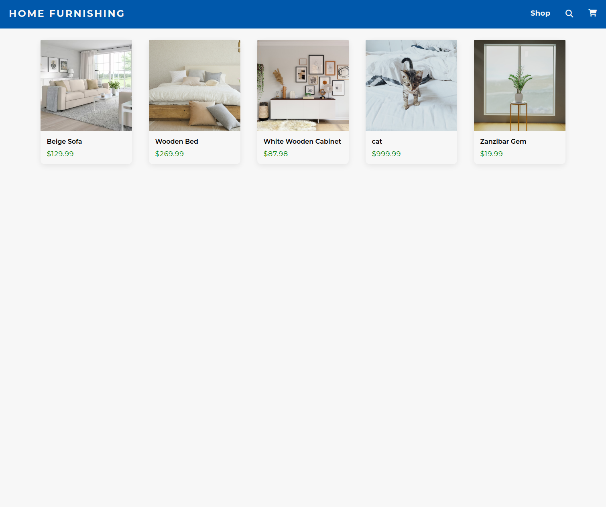
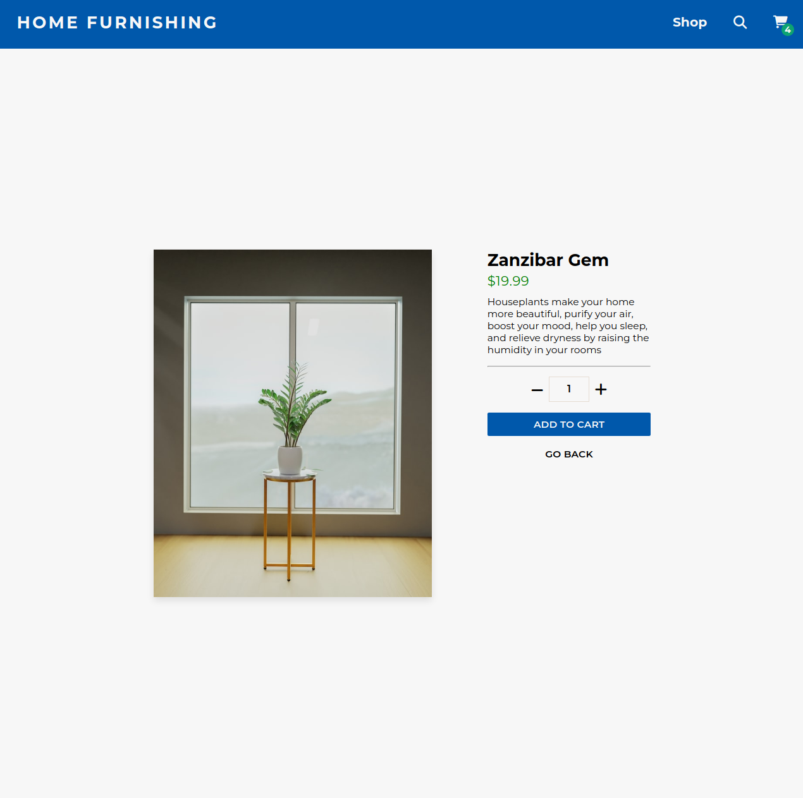
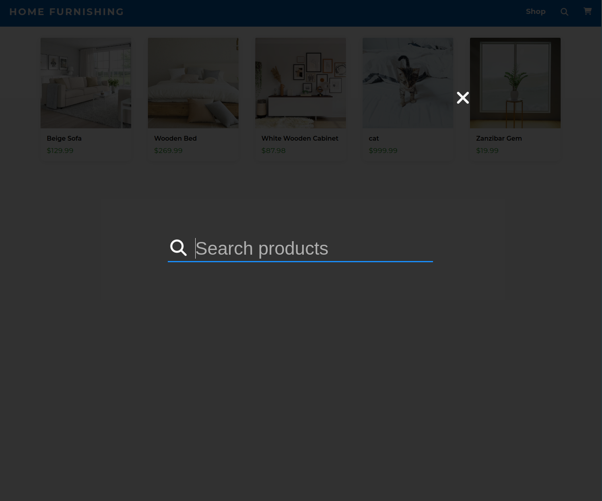
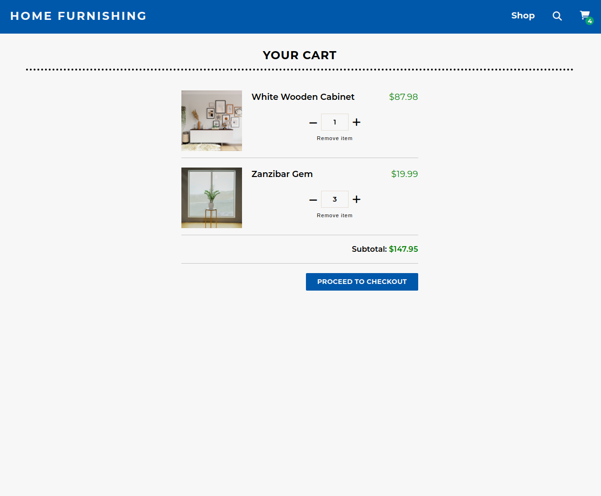

## Short Description

An e-commerce store, imitating a furniture store, built with React. Includes dedicated product pages, search functionality, and more. Responsive and tested with Jest & TDD.

> See it live on [sharkri.github.io/shopping-cart/
> ](https://sharkri.github.io/shopping-cart/)

## Showcase

#### Homepage

#### Shop

#### Product Page

#### Search

#### Cart

## Objectives & Outcomes

The main motivation for this work was to design and deploy a multiple page application using [react router](https://reactrouter.com/web/guides/quick-start).

## Technologies

- [React.js](https://reactjs.org/) - A JavaScript library for building user interfaces
- [React Testing Library](https://testing-library.com/) - A library for testing React applications
- [ESLint](https://eslint.org/) - A linter tool to standardize code
- [Github Pages](https://pages.github.com/) - Hosting
- [React Router](https://reactrouter.com/web/guides/quick-start) - Router tool for React applications
- [Git](https://git-scm.com/) - An open source distributed version control system
